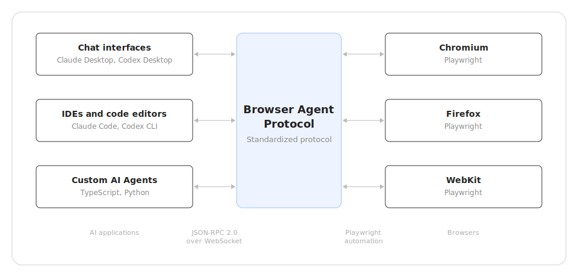

# Browser Agent Protocol (BAP)

[](https://www.npmjs.com/package/@browseragentprotocol/cli)
[](https://www.npmjs.com/package/@browseragentprotocol/mcp)
[](https://opensource.org/licenses/Apache-2.0)

An open standard for AI agents to interact with web browsers. Two interfaces: **CLI** for shell-based agents, **MCP** for protocol-native agents.

```bash
# CLI — any agent that can run shell commands
npx @browseragentprotocol/cli open https://example.com
npx @browseragentprotocol/cli act 'click:text:"More information..."' snapshot

# MCP — agents with native Model Context Protocol support
npx @browseragentprotocol/mcp
```

<p align="center">
  
</p>

## Why BAP?

- **Composite Actions**: Execute multi-step flows in one command — 40x fewer tokens than one-action-at-a-time
- **Fused Operations**: Combine navigate+observe, act+observe into single server calls — 50-85% fewer roundtrips
- **Semantic Selectors**: Target elements by purpose (`role:button:"Submit"`) not position — survives redesigns
- **Structured Extraction**: Extract validated JSON from any page with a schema
- **Two Interfaces**: CLI (`bap act`) for shell-based agents, MCP tools for protocol-native agents
- **Accessibility-First**: Built on accessibility tree inspection, designed for AI comprehension
- **Element References**: Stable refs (`@e1`, `e15`) that persist across observations
- **Screenshot Annotation**: Set-of-Marks overlays with numbered badges for vision models

## Quick Start

### CLI — For AI Agents That Run Shell Commands

```bash
# Open a page and observe interactive elements
bap open https://example.com
bap observe --max=20

# Login flow in ONE command (vs 3+ separate commands)
bap act fill:role:textbox:"Email"="user@example.com" \
        fill:role:textbox:"Password"="secret" \
        click:role:button:"Sign in"

# Extract structured data
bap extract --fields="title,price,rating"

# Use semantic selectors
bap click role:button:"Get Started"
bap fill label:"Email" "user@example.com"
```

Install globally or use via npx:

```bash
npm i -g @browseragentprotocol/cli
# or
npx @browseragentprotocol/cli <command>
```

See the full [CLI documentation](./packages/cli) for all 26 commands, selector reference, and recipes.

### MCP — For Protocol-Native Agents

```
navigate({ url: "https://example.com/login" })
observe({ includeScreenshot: true })
act({
  steps: [
    { action: "action/fill", selector: "@e1", value: "user@example.com" },
    { action: "action/fill", selector: "@e2", value: "password123" },
    { action: "action/click", selector: "role:button:Sign in" }
  ]
})
```

See the [MCP documentation](./packages/mcp) for tool reference and configuration.

## Integrations

### Claude Code

**CLI** (install skill for optimal usage):
```bash
npm i -g @browseragentprotocol/cli
bap install-skill
```

**MCP server** (one command):
```bash
claude mcp add --transport stdio bap-browser -- npx -y @browseragentprotocol/mcp
```

**Plugin** (includes SKILL.md for smarter tool usage):
```bash
claude plugin add --from https://github.com/browseragentprotocol/bap
```

<p align="center">
  <br>
  <em>Claude Code browsing Hacker News with BAP</em>
</p>

### Claude Desktop

Add to `~/Library/Application Support/Claude/claude_desktop_config.json` (macOS) or `%APPDATA%\Claude\claude_desktop_config.json` (Windows):

```json
{
  "mcpServers": {
    "bap-browser": {
      "command": "npx",
      "args": ["-y", "@browseragentprotocol/mcp"]
    }
  }
}
```

Restart Claude Desktop after saving.

<p align="center">
  <br>
  <em>Claude Desktop browsing Hacker News with BAP</em>
</p>

### Codex CLI

**CLI**:
```bash
npm i -g @browseragentprotocol/cli
bap install-skill
```

**MCP**:
```bash
codex mcp add bap-browser -- npx -y @browseragentprotocol/mcp
```

Or add to `~/.codex/config.toml`:

```toml
[mcp_servers.bap-browser]
command = "npx"
args = ["-y", "@browseragentprotocol/mcp"]
```

<p align="center">
  <br>
  <em>Codex CLI browsing Hacker News with BAP</em>
</p>

### Codex Desktop

Add to `~/.codex/config.toml`:

```toml
[mcp_servers.bap-browser]
command = "npx"
args = ["-y", "@browseragentprotocol/mcp"]
```

<p align="center">
  <br>
  <em>Codex Desktop browsing Hacker News with BAP</em>
</p>

### Gemini CLI

**CLI**:
```bash
npm i -g @browseragentprotocol/cli
bap install-skill
```

**MCP** — add to `~/.gemini/settings.json`:

```json
{
  "mcpServers": {
    "bap-browser": {
      "command": "npx",
      "args": ["-y", "@browseragentprotocol/mcp"]
    }
  }
}
```

### Manus

Manus supports MCP servers via its web UI (HTTP transport only):

1. Go to **Settings > Integrations > Custom MCP Servers**
2. Click **Add Server**
3. Set transport to **HTTP** and provide your hosted BAP MCP endpoint URL
4. Save and verify connection

> **Note:** Manus requires HTTP/SSE transport. To use BAP with Manus, deploy the MCP server as an HTTP endpoint using a stdio-to-HTTP bridge like [mcp-remote](https://www.npmjs.com/package/mcp-remote), then register the URL in the Manus UI.

### Other Agents

BAP CLI includes a built-in skill installer that supports 13 AI coding agent platforms:

```bash
bap install-skill           # Auto-detect and install to all agents
bap install-skill --dry-run # Preview what would be installed
```

Supported: Claude Code, Codex CLI, Gemini CLI, Cursor, GitHub Copilot, Windsurf, Roo Code, Amp, Deep Agents, OpenCode, and more.

### Browser Selection

By default, BAP uses your locally installed Chrome. Switch browsers with:

```bash
# CLI
bap config browser firefox

# MCP — pass via args
npx @browseragentprotocol/mcp --browser firefox
```

| Value | Browser | Notes |
|---|---|---|
| `chrome` (default) | Local Chrome | Falls back to bundled Chromium if not installed |
| `chromium` | Bundled Chromium | Playwright's built-in Chromium |
| `firefox` | Firefox | Requires local Firefox |
| `webkit` | WebKit | Playwright's WebKit engine |
| `edge` | Microsoft Edge | Requires local Edge |

## Packages

### TypeScript

| Package | Description | npm |
|---------|-------------|-----|
| [`@browseragentprotocol/cli`](./packages/cli) | CLI for shell-based AI agents | [](https://www.npmjs.com/package/@browseragentprotocol/cli) |
| [`@browseragentprotocol/mcp`](./packages/mcp) | MCP integration for protocol-native agents | [](https://www.npmjs.com/package/@browseragentprotocol/mcp) |
| [`@browseragentprotocol/client`](./packages/client) | TypeScript client SDK | [](https://www.npmjs.com/package/@browseragentprotocol/client) |
| [`@browseragentprotocol/server-playwright`](./packages/server-playwright) | Server implementation using Playwright | [](https://www.npmjs.com/package/@browseragentprotocol/server-playwright) |
| [`@browseragentprotocol/protocol`](./packages/protocol) | Protocol types, schemas, and utilities | [](https://www.npmjs.com/package/@browseragentprotocol/protocol) |
| [`@browseragentprotocol/logger`](./packages/logger) | Pretty logging utilities | [](https://www.npmjs.com/package/@browseragentprotocol/logger) |

### Python

| Package | Description | PyPI |
|---------|-------------|------|
| [`browser-agent-protocol`](./packages/python-sdk) | Python SDK with async/sync APIs | [](https://pypi.org/project/browser-agent-protocol/) |

## Architecture

```
AI Agent (shell)                AI Agent (MCP-native)
    │                               │
    ▼                               ▼
@browseragentprotocol/cli    @browseragentprotocol/mcp
    │                               │
    ▼                               ▼
@browseragentprotocol/client ───────┘
    │
    ▼  WebSocket (JSON-RPC 2.0)
@browseragentprotocol/server-playwright
    │
    ▼  Playwright
Browser (Chromium / Firefox / WebKit)
```

The CLI spawns the server as a background daemon that persists across commands. The MCP bridge runs as a stdio process managed by the host agent.

## Using the SDKs

### TypeScript

```typescript
import { BAPClient, role } from "@browseragentprotocol/client";

const client = new BAPClient("ws://localhost:9222");
await client.connect();

await client.launch({ browser: "chromium", headless: false });
await client.createPage({ url: "https://example.com" });

// Semantic selectors
await client.click(role("button", "Submit"));
await client.fill(role("textbox", "Email"), "user@example.com");

// Composite actions
const result = await client.act({
  steps: [
    { action: "action/fill", params: { selector: label("Email"), value: "user@example.com" } },
    { action: "action/fill", params: { selector: label("Password"), value: "secret123" } },
    { action: "action/click", params: { selector: role("button", "Sign In") } },
  ],
});

await client.close();
```

### Python

```bash
pip install browser-agent-protocol
```

```python
import asyncio
from browseragentprotocol import BAPClient, role, label

async def main():
    async with BAPClient("ws://localhost:9222") as client:
        await client.launch(browser="chromium", headless=False)
        await client.create_page(url="https://example.com")

        await client.click(role("button", "Submit"))
        await client.fill(label("Email"), "user@example.com")

asyncio.run(main())
```

## Selectors

BAP uses semantic selectors that survive DOM changes:

| Selector | Example | Priority |
|----------|---------|----------|
| `role:<role>:"<name>"` | `role:button:"Submit"` | Best — ARIA role + accessible name |
| `text:"<content>"` | `text:"Sign in"` | Visible text content |
| `label:"<text>"` | `label:"Email"` | Form label association |
| `placeholder:"<text>"` | `placeholder:"Search..."` | Input placeholder |
| `testid:"<id>"` | `testid:"submit-btn"` | data-testid attribute |
| `e<N>` / `@ref` | `e15`, `@e1` | From snapshot/observe (positional) |
| `css:<selector>` | `css:.btn-primary` | Last resort — fragile |

## Development

```bash
git clone https://github.com/browseragentprotocol/bap.git
cd bap
pnpm install
pnpm build
pnpm typecheck
pnpm lint
pnpm test
```

## Contributing

We welcome contributions! Please open an issue or submit a pull request on GitHub.

## License

Apache License 2.0 - see the [LICENSE](LICENSE) file for details.

## Links

- [GitHub Repository](https://github.com/browseragentprotocol/bap)
- [npm Organization](https://www.npmjs.com/org/browseragentprotocol)
- [Issue Tracker](https://github.com/browseragentprotocol/bap/issues)
