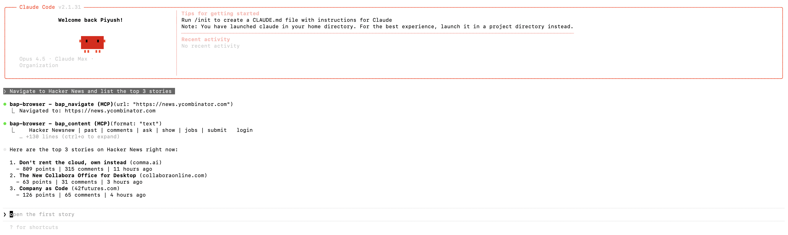
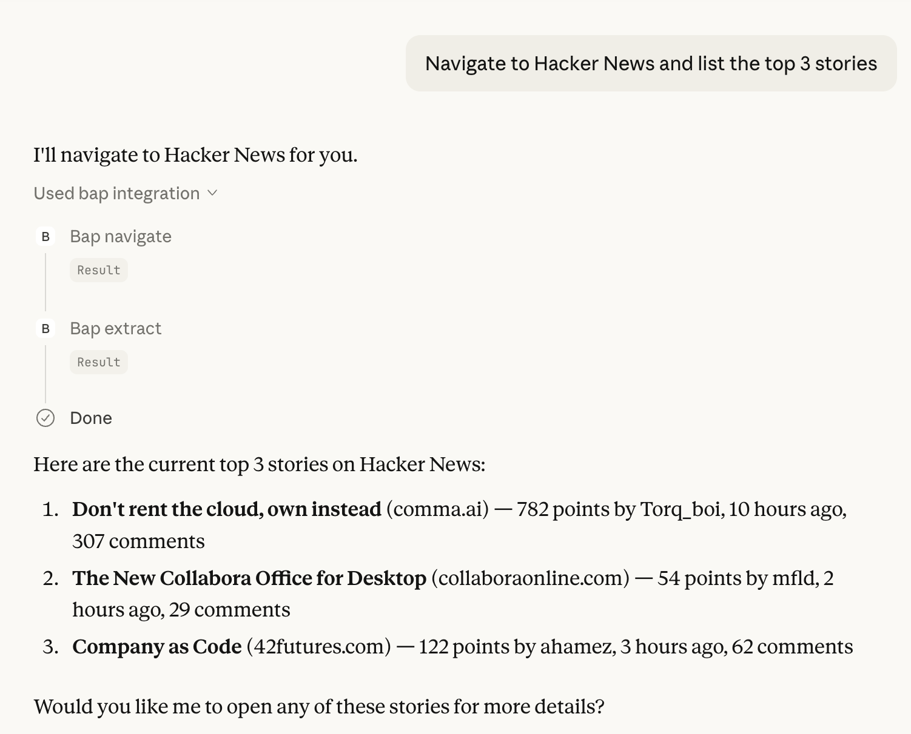
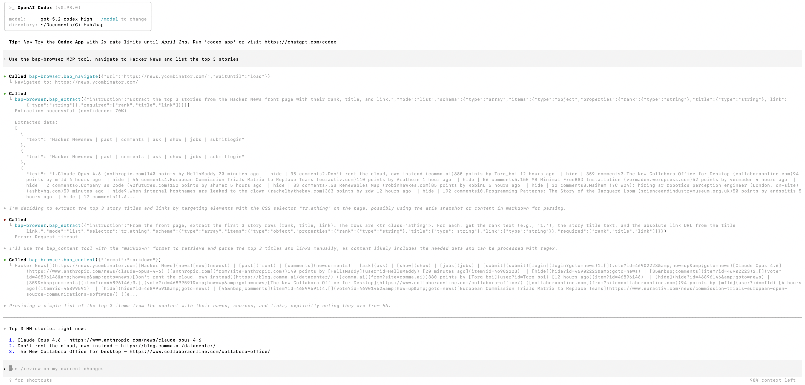
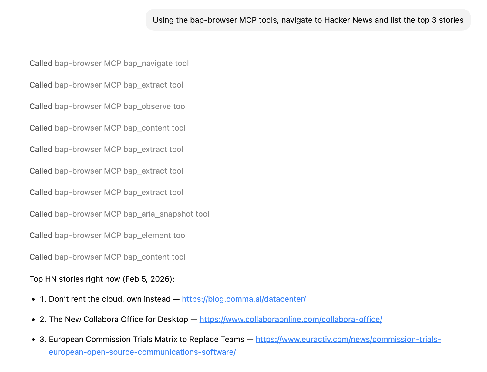

# Browser Agent Protocol (BAP)

[](https://www.npmjs.com/package/@browseragentprotocol/protocol)
[](https://opensource.org/licenses/Apache-2.0)

An open standard for AI agents to interact with web browsers.

> **⚠️ Alpha Release:** This is an experimental release. APIs may change between versions.

## Overview

BAP (Browser Agent Protocol) provides a standardized way for AI agents to control web browsers. It uses JSON-RPC 2.0 over WebSocket for communication and includes semantic selectors designed for AI comprehension.

### Key Features

- **Semantic Selectors**: Use accessibility roles, text content, and labels instead of brittle CSS selectors
- **Accessibility-First**: Built-in support for accessibility tree inspection
- **AI-Optimized**: Designed for LLM-based agents with token-efficient observations
- **MCP Integration**: Works seamlessly with [Model Context Protocol](https://modelcontextprotocol.io)
- **Composite Actions**: Execute multi-step action sequences in a single round-trip (`agent/act`, `agent/observe`, `agent/extract`)
- **Element References**: Stable element refs (`@submitBtn`, `@e7f3a2`) that persist across observations
- **Screenshot Annotation**: Set-of-Marks style overlays with numbered badges for vision models
- **Multi-Context Support**: Parallel isolated browser sessions with `context/create`, `context/list`, `context/destroy`
- **Human-in-the-Loop Approval**: Enterprise workflow for human oversight of sensitive actions
- **Frame Support**: Explicit frame switching for iframes with `frame/list`, `frame/switch`, `frame/main`
- **Streaming Responses**: Chunked transfers for large observations with checksum verification

## Packages

### TypeScript

| Package | Description | npm |
|---------|-------------|-----|
| [`@browseragentprotocol/protocol`](./packages/protocol) | Protocol types, schemas, and utilities | [](https://www.npmjs.com/package/@browseragentprotocol/protocol) |
| [`@browseragentprotocol/logger`](./packages/logger) | Pretty logging utilities with colors and icons | [](https://www.npmjs.com/package/@browseragentprotocol/logger) |
| [`@browseragentprotocol/client`](./packages/client) | TypeScript client SDK | [](https://www.npmjs.com/package/@browseragentprotocol/client) |
| [`@browseragentprotocol/server-playwright`](./packages/server-playwright) | Server implementation using Playwright | [](https://www.npmjs.com/package/@browseragentprotocol/server-playwright) |
| [`@browseragentprotocol/mcp`](./packages/mcp) | Model Context Protocol integration | [](https://www.npmjs.com/package/@browseragentprotocol/mcp) |

### Python

| Package | Description | PyPI |
|---------|-------------|------|
| [`browser-agent-protocol`](./packages/python-sdk) | Python SDK with async/sync APIs | [](https://pypi.org/project/browser-agent-protocol/) |

## Quick Start

### Using with MCP (Recommended for AI Agents)

BAP works with any MCP-compatible client including Claude Code, Claude Desktop, OpenAI Codex, and Google Antigravity.

**Claude Code:**
```bash
claude mcp add --transport stdio bap-browser -- npx @browseragentprotocol/mcp
```

<p align="center">
  <br>
  <em>Claude Code browsing Hacker News with BAP</em>
</p>

**Claude Desktop** (`claude_desktop_config.json`):
```json
{
  "mcpServers": {
    "bap-browser": {
      "command": "npx",
      "args": ["@browseragentprotocol/mcp"]
    }
  }
}
```

<p align="center">
  <br>
  <em>Claude Desktop browsing Hacker News with BAP</em>
</p>

**Codex CLI:**
```bash
codex mcp add bap-browser -- npx @browseragentprotocol/mcp
```

<p align="center">
  <br>
  <em>Codex CLI browsing Hacker News with BAP</em>
</p>

**Codex Desktop** (`~/.codex/config.toml`):
```toml
[mcp_servers.bap-browser]
command = "npx"
args = ["@browseragentprotocol/mcp"]
```

<p align="center">
  <br>
  <em>Codex Desktop browsing Hacker News with BAP</em>
</p>

> **💡 Tip:** Codex may default to web search. Be explicit: *"Using the bap-browser MCP tools..."*


**Antigravity** (`mcp_config.json` via "..." → MCP Store → Manage):
```json
{
  "mcpServers": {
    "bap-browser": {
      "command": "npx",
      "args": ["@browseragentprotocol/mcp"]
    }
  }
}
```

### Using the TypeScript SDK

#### Start the Server

```bash
npx @browseragentprotocol/server-playwright
```

#### Connect from TypeScript

```typescript
import { BAPClient, role } from "@browseragentprotocol/client";

const client = new BAPClient("ws://localhost:9222");
await client.connect();

// Launch browser and navigate
await client.launch({ browser: "chromium", headless: false });
await client.createPage({ url: "https://example.com" });

// Use semantic selectors (AI-friendly)
await client.click(role("button", "Submit"));
await client.fill(role("textbox", "Email"), "user@example.com");

// Get accessibility tree for AI reasoning
const { tree } = await client.accessibility();

await client.close();
```

### Using the Python SDK

```bash
pip install browser-agent-protocol
```

```python
import asyncio
from browseragentprotocol import BAPClient, role, label

async def main():
    async with BAPClient("ws://localhost:9222") as client:
        # Launch browser and navigate
        await client.launch(browser="chromium", headless=False)
        await client.create_page(url="https://example.com")

        # Use semantic selectors (AI-friendly)
        await client.click(role("button", "Submit"))
        await client.fill(label("Email"), "user@example.com")

        # Get accessibility tree for AI reasoning
        tree = await client.accessibility()

asyncio.run(main())
```

For synchronous usage (scripts, notebooks):

```python
from browseragentprotocol import BAPClientSync, role

with BAPClientSync("ws://localhost:9222") as client:
    client.launch(browser="chromium", headless=True)
    client.create_page(url="https://example.com")
    client.click(role("button", "Submit"))
```

### Semantic Selectors

BAP uses semantic selectors that are more stable and readable than CSS selectors:

```typescript
import { role, text, label, testId, ref } from "@browseragentprotocol/client";

// By accessibility role and name
await client.click(role("button", "Submit"));
await client.fill(role("textbox", "Search"));

// By visible text content
await client.click(text("Sign in"));

// By associated label
await client.fill(label("Email address"), "user@example.com");

// By test ID (for automation)
await client.click(testId("submit-button"));

// By stable element reference (from agent/observe)
await client.click(ref("@submitBtn"));
```

### AI Agent Methods

BAP provides composite methods optimized for AI agents:

```typescript
// agent/observe - Get AI-optimized page snapshot
const observation = await client.observe({
  includeAccessibility: true,
  includeInteractiveElements: true,
  includeScreenshot: true,
  maxElements: 50,
  annotateScreenshot: true,  // Set-of-Marks style
});

// Interactive elements with stable refs
for (const el of observation.interactiveElements) {
  console.log(`${el.ref}: ${el.role} - ${el.name}`);
  // @e1: button - Submit
  // @e2: textbox - Email
}

// agent/act - Execute multi-step sequences atomically
const result = await client.act({
  steps: [
    { action: "action/fill", params: { selector: label("Email"), value: "user@example.com" } },
    { action: "action/fill", params: { selector: label("Password"), value: "secret123" } },
    { action: "action/click", params: { selector: role("button", "Sign In") } },
  ],
});
console.log(`Completed ${result.completed}/${result.total} steps`);

// agent/extract - Extract structured data
const data = await client.extract({
  instruction: "Extract all product names and prices",
  schema: {
    type: "array",
    items: {
      type: "object",
      properties: {
        name: { type: "string" },
        price: { type: "number" },
      },
    },
  },
});
```

> **Note:** `agent/extract` (and `bap_extract` in MCP) uses heuristic-based extraction (CSS patterns). For complex pages, consider using `bap_content` to get page content as markdown and extract data yourself.

## Server Options

```bash
npx @browseragentprotocol/server-playwright [options]

Options:
  -p, --port <number>       WebSocket port (default: 9222)
  -h, --host <host>         Host to bind to (default: localhost)
  -b, --browser <browser>   Browser: chromium, firefox, webkit (default: chromium)
  --headless                Run in headless mode (default: true)
  --no-headless             Run with visible browser window
  -t, --timeout <ms>        Default timeout in milliseconds (default: 30000)
  -d, --debug               Enable debug logging
  --token <token>           Authentication token for client connections
  --help                    Show help
  -v, --version             Show version
```

## CLI Tools

### Python CLI

```bash
# Test connection to a BAP server
bap connect ws://localhost:9222

# Get server info
bap info ws://localhost:9222 --json
```

### TypeScript Server CLI

```bash
# Start the server
npx @browseragentprotocol/server-playwright --port 9222 --no-headless

# Start with debug logging
npx @browseragentprotocol/server-playwright --debug
```

## Development

```bash
# Clone the repository
git clone https://github.com/browseragentprotocol/bap.git
cd bap

# Install dependencies
pnpm install

# Build all packages
pnpm build

# Run type checking
pnpm typecheck

# Run linting
pnpm lint

# Install Python SDK in development mode
cd packages/python-sdk && pip install -e .
```

## Contributing

We welcome contributions! Please open an issue or submit a pull request on GitHub.

## License

This project is licensed under the Apache License 2.0 - see the [LICENSE](LICENSE) file for details.

## Links

- [GitHub Repository](https://github.com/browseragentprotocol/bap)
- [npm Organization](https://www.npmjs.com/org/browseragentprotocol)
- [Issue Tracker](https://github.com/browseragentprotocol/bap/issues)
