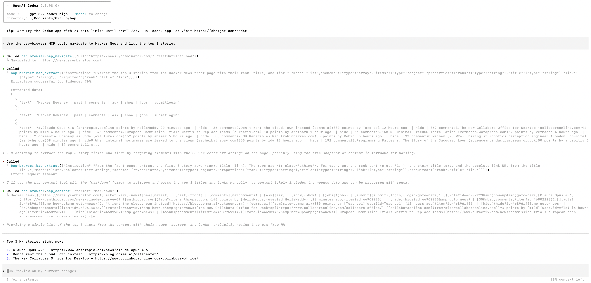
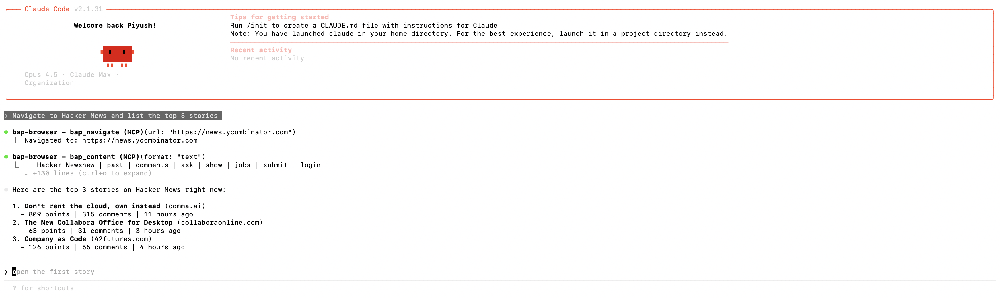

# Browser Agent Protocol (BAP)

Give your coding agent a real browser that feels fast, semantic, and reliable.

BAP is the browser layer for Codex, Claude Code, and other AI agents. It keeps
a real browser session warm, observes pages in an AI-friendly way, and lets
agents act with semantic selectors and fused operations instead of brittle CSS
and endless roundtrips.

<p align="center">
  
</p>

<p align="center">
  <a href="https://www.npmjs.com/package/@browseragentprotocol/cli">CLI</a> •
  <a href="https://www.npmjs.com/package/@browseragentprotocol/mcp">MCP</a> •
  <a href="https://pypi.org/project/browser-agent-protocol/">Python</a> •
  <a href="./packages/cli/README.md">Docs</a> •
  <a href="./LICENSE">Apache-2.0</a>
</p>

## Start Here

For most users, the best setup is `CLI + SKILL.md`.

```bash
npm i -g @browseragentprotocol/cli
bap install-skill
bap goto https://news.ycombinator.com --observe --max=12
```

Then ask your agent something like:

```text
Use BAP to open Hacker News, list the top 3 posts, and open the first one.
```

If you just installed the skill, start a fresh Claude/Codex session so it
reloads the BAP guidance.

## Why Developers Try BAP

- **Real browser workflow:** BAP prefers installed Chrome, keeps session state warm, and stays close to a normal user browser instead of starting from scratch on every command.
- **Better selectors:** use `role:button:"Submit"` and `label:"Email"` instead of brittle CSS.
- **Fewer roundtrips:** `goto --observe`, `act --observe`, stable refs, and structured extraction cut tool chatter.
- **Sticky agent experience:** the browser daemon stays warm across commands, so agents keep momentum instead of constantly reopening tabs and re-observing the world.
- **Multiple surfaces:** start with the CLI, use MCP when your platform wants tools, and drop to TypeScript or Python SDKs when you want to embed BAP in your own stack.

## What It Looks Like

<p align="center">
  
</p>

## Quick Examples

### Browse and observe

```bash
bap goto https://example.com --observe
```

### Log in with one fused action

```bash
bap act \
  fill:role:textbox:"Email"="user@example.com" \
  fill:role:textbox:"Password"="secret" \
  click:role:button:"Sign in" \
  --observe
```

### Extract structured data

```bash
bap extract --fields="title,price,rating"
```

## Smooth First Run

- `CLI + SKILL.md` is the default path for Claude Code, Codex, and other coding agents that can run shell commands.
- BAP prefers headful Chrome and a persistent session by default.
- Use `--headless` for CI or background runs.
- Use `--no-profile` if your normal Chrome profile is busy.
- Use `--profile <dir>` for a dedicated long-lived automation profile with cookies and state.
- Use `bap close-all` when you want to stop the daemon and browser sessions completely.

## Choose Your Interface

- **CLI + SKILL.md:** the main path and the best place to start.
- **MCP:** the second choice for tool-native clients that prefer an MCP server.
- **TypeScript SDK:** for apps, agent backends, and custom integrations.
- **Python SDK:** for notebooks, backend jobs, and Python agents.

Need MCP instead of shell commands?

```bash
npx -y @browseragentprotocol/mcp
```

Need SDKs?

```bash
npm install @browseragentprotocol/client
pip install browser-agent-protocol
```

## Try the Repo Demo

- [Examples index](./examples/README.md)
- [Hacker News CLI demo](./examples/hacker-news-cli/README.md)

Quick run from the repo:

```bash
npx pnpm install
npx pnpm build
./examples/hacker-news-cli/run-cli-demo.sh
```

This writes an observation, screenshot, and accessibility snapshot to
`.bap/demo/hacker-news/`.

## Against Other Browser Tools

- **Against Playwright CLI:** BAP is built for agent workflows, not just human shell scripting.
- **Against Playwright MCP:** when shell access is available, BAP CLI can solve the same job with fewer agent roundtrips.
- **Against Chrome DevTools/CDP:** CDP is the low-level browser transport; BAP is the higher-level agent layer on top.

## Docs

- [CLI documentation](./packages/cli/README.md)
- [MCP documentation](./packages/mcp/README.md)
- [TypeScript SDK documentation](./packages/client/README.md)
- [Python SDK documentation](./packages/python-sdk/README.md)
- [Browser automation decision guide](./docs/browser-tools-guide.md)
- [BAP and WebMCP comparison](./docs/webmcp-comparison.md)

## For Maintainers

- [Release automation guide](./docs/releasing.md)
- [Contributing](./CONTRIBUTING.md)
- [Code of conduct](./CODE_OF_CONDUCT.md)
- [Security policy](./SECURITY.md)

## License

Code in this repo is Apache-2.0. Some bundled assets and documentation have
additional notices described in [LICENSE](./LICENSE).
